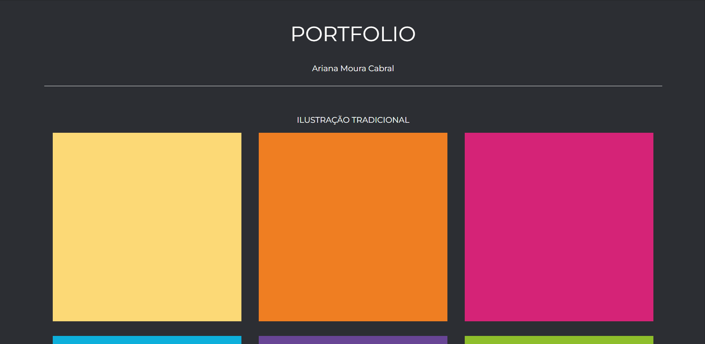

## Minimalist portfolio in dark theme

> A simple art portfolio using only HTML, CSS and Bootstrap!

| [  TEMPLATE ](demo/demo_portfolio.gif)  |  [  MY ART PORTFOLIO (EXAMPLE)](demo/demo_portfolio.gif)  |
| :---: | :---: |

## Color Palette 🎨

Element        | Hex       | Color
---            | ---       | ---               
Background     | `#2c2f33` |  
Body elements  | `#ffffff` | 
Hover (icon)   | `#a200ff` |  
Image          | `#fdda76` | 
Image          | `#f07e22` |  
Image          | `#d62377` | 
Image          | `#0dafdb` | 
Image          | `#694595` |  
Image          | `#8ebf2b` | 

## Technologies and Languages 💻

**Front-end**

  
  
  

  

**Icons**

  

  

## Installation Steps 🛠️

You don't need to do anything to see and use this template. 

## Details 🔭

Notepad or [Notepad++](https://notepad-plus-plus.org/) can be used to make changes.

Modify the html file [``index.html``](https://github.com/arianacabral/minimalist-portfolio/blob/main/index.html) to change the elements or add new ones. You can also style your portfolio by modifying the CSS file  [``index.css``](https://github.com/arianacabral/minimalist-portfolio/blob/main/index.html).

## Contributing 🍰

Please contribute using [GitHub Flow](https://guides.github.com/introduction/flow). Create a branch, add commits, and open a pull request. 

## Contact 📬

For more information or questions, please contact me

 
  
  
   

 

    <b><a href="#home">▲ top</a></b>

